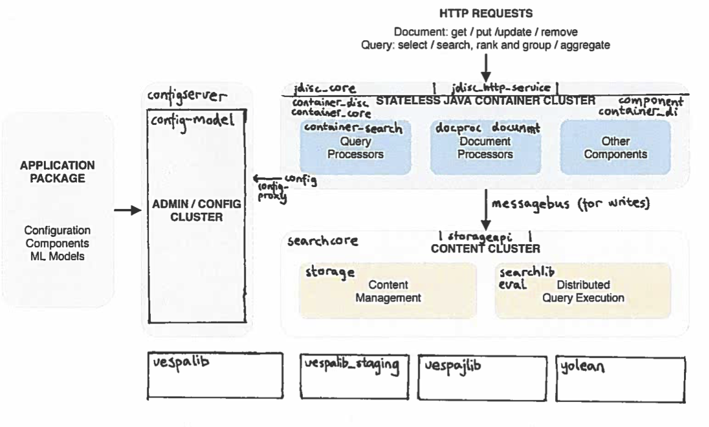

<!-- Copyright Yahoo. Licensed under the terms of the Apache 2.0 license. See LICENSE in the project root. -->

# A map to the Vespa code base

You want to get familiar with the Vespa code base but don't know where to start?

Vespa consists of about 1.7 million lines of code, about equal parts Java and C++.
Since it it's mostly written by a team of developers selected for their ability 
to do this kind of thing unusually well, who have been given time to dedicate 
themselves to it for a long time, it is mostly easily to work with. However, one 
thing we haven't done is to create a module structure friendly to newcomers - the code
simply organized in a flat structure of about 150 modules. 

This document aims to provide a map from the
[functional elements](https://docs.vespa.ai/en/overview.html)
of Vespa to the most important modules in the flat module structure in the
[code base on GitHub](https://github.com/vespa-engine/vespa).

It covers the modules you are most likely to encounter as a developer. 
The rest are either small and needed for technical reasons or doing one thing 
which should be self-explanatory, or implementing the cloud service run by the 
Vespa team which we don't expect anybody else to run and therefore be interested 
in changing.

## The stateless container

When a request is made to Vespa it first enters some stateless container cluster,
called jDisc. This consists of:

- a __jDisc core__ layer which provides a model of a running application, general protocol-independent request-response handling, with various protocol implementations,
- a __jDisc container__ layer providing component management, configuration and similar.
- a __search middleware__ layer containing query/result API's, query execution logic etc.
- API's and modules for writing and processing document operations.

The stateless container is implemented in Java.

jDisc core modules:

- [jdisc_core](https://github.com/vespa-engine/vespa/tree/master/jdisc_core) - the core jDisc functionality

jDisc container modules, layered on jDisc core:

- [container-disc](https://github.com/vespa-engine/vespa/tree/master/container-disc) - integration between the jDisc container and jDisc core layers.
- [container-core](https://github.com/vespa-engine/vespa/tree/master/container-core) - core jDisc container functionality: Metrics, OSGi integration for component bundles, dependency injection, HTTP connector, etc.
- [component](https://github.com/vespa-engine/vespa/tree/master/component) - the component model. Components (in Java) will implement or subclass a type for this module.

Search container, layered on jDisc container:

- [container-search](https://github.com/vespa-engine/vespa/tree/master/container-search) - Query-Result processing framework (Searchers) layered over the generic processing framework, query profiles, and the global query execution logic: Dispatch (scatter-gather), grouping, etc.

Document operation modules:

- [document](https://github.com/vespa-engine/vespa/tree/master/document) - the document model - documents, fields and document types, and operations on documents. Implemented in both Java and C++.
- [messagebus](https://github.com/vespa-engine/vespa/tree/master/messagebus) - generic async, multi-hop message passing implemented in both Java and C++.
- [container-messagebus](https://github.com/vespa-engine/vespa/tree/master/container-messagebus) - MessageBus connector for jDisc.
- [documentapi](https://github.com/vespa-engine/vespa/tree/master/documentapi) - API for issuing document operations to Vespa over messagebus.
- [docproc](https://github.com/vespa-engine/vespa/tree/master/docproc) - chainable document (operation) processors: Document operations issued over messagebus to Vespa will usually be routed through a container running a document processor chain.
- [indexinglanguage](https://github.com/vespa-engine/vespa/tree/master/indexinglanguage) - implementation of the "indexing" language which is used to express the statements prefixed by "indexing:" in the search definition. 
- [docprocs](https://github.com/vespa-engine/vespa/tree/master/docprocs) - document processor components bundled with Vespa. Notably the Indexingprocessor - a document processor invoking the indexing language statements configured for the document type in question on document operations.
- [vespaclient-container-plugin](https://github.com/vespa-engine/vespa/tree/master/vespaclient-container-plugin) - implements the document/v1 API and internal API used by the Java HTTP client on top of the jDisc container, forwarding to the Document API.
- [vespa-feed-client](https://github.com/vespa-engine/vespa/tree/master/vespa-feed-client) - client for fast writing to the internal API implemented by vespaclient-container-plugin.

## Content nodes

Content nodes store all data in Vespa, maintains reverse and forward indexes, and performs the distributed parts of query execution - matching, ranking and grouping/aggregation.
This is written in C++.

- [searchcore](https://github.com/vespa-engine/vespa/tree/master/searchcore) - core functionality for maintaining indexes, matching, data storage, grouping, as well as the content node server itself (called proton).
- [searchlib](https://github.com/vespa-engine/vespa/tree/master/searchlib) - libraries invoked by searchcore: Ranking (feature execution framework (fef), rank feature implementations, ranking expressions), index and btree implementations, attributes (forward indexes) etc. In addition, this contains the Java libraries for ranking.
- [storage](https://github.com/vespa-engine/vespa/tree/master/storage/src/vespa/storage) - system for elastic and auto-recovering data storage over clusters of nodes.
- [eval](https://github.com/vespa-engine/vespa/tree/master/eval) - library for efficient evaluation of ranking expressions. Tensor API and implementation.
- [storageapi](https://github.com/vespa-engine/vespa/tree/master/storageapi/src/vespa/storageapi) - message bus messages and implementation for the document API.
- [clustercontroller-core](https://github.com/vespa-engine/vespa/tree/master/clustercontroller-core) - cluster controller for storage, implemented in Java. This provides singular node-level decision making for storage, based on ZooKeeper.

## Configuration and administration

The third major subsystem in Vespa is responsible for managing configuration, clusters, application deployment and similar.
It is implemented in Java.

- [configserver](https://github.com/vespa-engine/vespa/tree/master/configserver) - the server to which applications are deployed, and nodes send requests for the configuration derived from these deployments.
- [config-model](https://github.com/vespa-engine/vespa/tree/master/config-model) - a model of the running system specified by a deployed application, which returns config instances on request given a config type name and config id (associated with a role).
- [config](https://github.com/vespa-engine/vespa/tree/master/config) - client-side library on both Java and C++ for subscribing to configs (by type name and id) and reading config payloads.
- [configgen](https://github.com/vespa-engine/vespa/tree/master/configgen) - generation of config classes in C++ and Java for reading (and building) a config given its type.
- [config-proxy](https://github.com/vespa-engine/vespa/tree/master/config-proxy) - client node-side proxy between config subscriptions (issued by config) and the config server.
- [configdefinitions](https://github.com/vespa-engine/vespa/tree/master/configdefinitions) - config type definitions which are referenced by multiple modules.

## General utility libraries

Libraries used throughput the code.

- [vespalib](https://github.com/vespa-engine/vespa/tree/master/vespalib) - general utility library for C++
- [vespajlib](https://github.com/vespa-engine/vespa/tree/master/vespajlib) - general utility library for Java. Includes the Java implementation of the tensor library.

