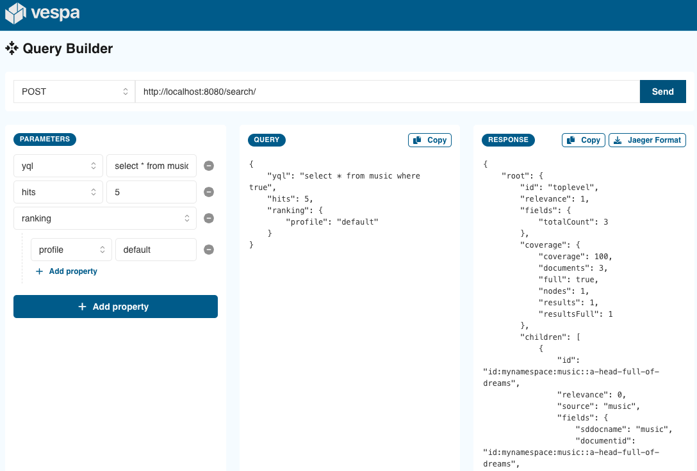
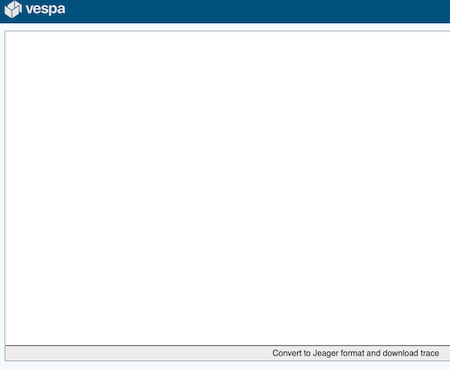
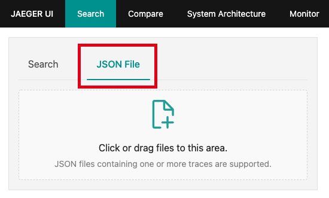
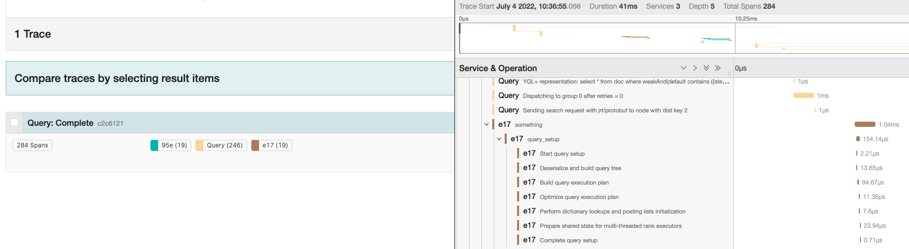

<!-- Copyright Yahoo. Licensed under the terms of the Apache 2.0 license. See LICENSE in the project root. -->


# Vespa client
This app contains the **Query Builder** and the **Trace Visualizer**.

Install and start:

    $ nvm install --lts node  # in case the installed node.js is too old
    $ yarn install
    $ yarn dev                # then open link, like http://127.0.0.1:3000/

Alternatively, use Docker to start it without installing node:

    $ docker run -v `pwd`:/w -w /w --publish 3000:3000 node:16 sh -c 'yarn install && yarn dev --host'

When started, open [http://127.0.0.1:3000/](http://127.0.0.1:3000/).

*Troubleshooting:* Remove the generated `node_modules` directory and try again.
This is also relevant when switching between running local and in the container.


## Query Builder
The Query Builder is a tool for creating Vespa queries to send to a local Vespa application.
The tool provides all of the options for query parameters from dropdowns.
The input fields provide hints to what is the expected type of value.



To access a Vespa endpoint from the Query Builder,
deploy with [CORS filters](https://developer.mozilla.org/en-US/docs/Web/HTTP/CORS).
To the query-serving container, add an `http` element in _services.xml_ like:
```
    <container id="default" version="1.0">

        <http>
            <filtering strict-mode="false">
                <request-chain id="request-chain">
                    <filter id="com.yahoo.jdisc.http.filter.security.cors.CorsPreflightRequestFilter"
                            bundle="jdisc-security-filters">
                        <config name="jdisc.http.filter.security.cors.cors-filter">
                            <allowedUrls>
                                <item>*</item>
                            </allowedUrls>
                        </config>
                    </filter>
                    <binding>http://*/search/</binding>
                </request-chain>

                <response-chain id="response-chain">
                    <filter id="com.yahoo.jdisc.http.filter.security.cors.CorsResponseFilter"
                            bundle="jdisc-security-filters">
                        <config name="jdisc.http.filter.security.cors.cors-filter">
                            <allowedUrls>
                                <item>*</item>
                            </allowedUrls>
                        </config>
                    </filter>
                    <binding>http://*/search/</binding>
                </response-chain>
            </filtering>

            <server port="8080" id="default"/>
        </http>
```

Deploy again, and (possibly) restart Vespa (internal port changes can be triggered by this).


## Trace Visualizer
The Trace Visualizer is a tool for converting and visualizing traces from Vespa in a flame graph.
To use the visualizer, a [Jaeger](https://www.jaegertracing.io/) instance must be run locally with Docker:

    docker run -d --rm \
      -p 16685:16685 \
      -p 16686:16686 \
      -p 16687:16687 \
      -e SPAN_STORAGE_TYPE=memory \
      jaegertracing/jaeger-query:latest

The Jaeger UI can then be reached at **localhost:16686/search**

To use the visualizer,
paste the Vespa trace into the text box
and press the button to convert the trace to a format supported by Jaeger and download it.
Only traces using _trace.timestamps=true_ **and** _traceLevel_ between 3 and 5 (inclusive) will work correctly -
see [query tracing](https://docs.vespa.ai/en/query-api.html#query-tracing):



After downloading the converted trace, it can be used with the Jaeger UI. 
Press the _JSON File_ button as shown in the image, and drag and drop the trace you just downloaded:



Then click on the newly added trace and see it displayed as a flame graph:


